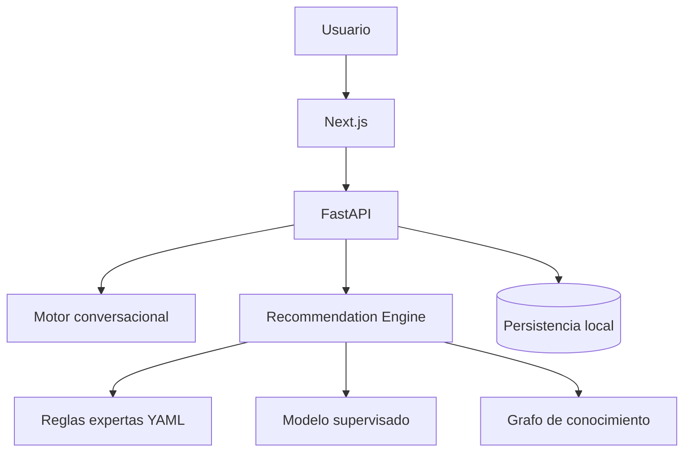

# OrientaIA

OrientaIA es un asistente inteligente de orientacion vocacional enfocado en exploracion academica. El sistema conversa con el estudiante, transforma esa conversacion en señales estructuradas y genera recomendaciones trazables a partir de un motor hibrido.

La recomendacion principal no depende de un LLM externo. Sale del backend mediante:

- reglas expertas
- modelo supervisado entrenado con datos sinteticos
- grafo de conocimiento

El chat existe para entrevistar al usuario, profundizar en sus intereses y explicar resultados ya calculados.

## Autor

- **Zkes11 - Santiago Rodriguez**
- **XonoderaX12345 - Sebastian Riascos**
## Estado actual del proyecto

El proyecto funciona como una demo tecnica local con:

- frontend en Next.js
- backend en FastAPI
- base local verificada en esta iteracion
- motor conversacional adaptativo
- motor hibrido de recomendacion
- planes de accion por conversacion

Estado validado en esta sesion:

- frontend levantado en `http://127.0.0.1:3003`
- API levantada en `http://127.0.0.1:8003/api/v1`

## Que hace el proyecto

OrientaIA busca ayudar a un estudiante a explorar que estudiar sin presentarse como prueba psicometrica clinica ni como sistema que decide por el usuario.

Permite:

- iniciar una conversacion vocacional
- detectar intereses, habilidades y preferencias
- hacer preguntas dinamicas segun lo dicho por el usuario
- calcular recomendaciones con puntaje de compatibilidad
- explicar por que salio cada opcion
- generar un plan de accion por cada chat
- conservar historial de conversaciones
- revisar dashboard, recomendaciones y planes

## Arquitectura



## Estructura principal

```text
apps/
  web/      Frontend Next.js
  api/      Backend FastAPI
docs/       Documentacion tecnica
intelligence/
  rules/    Reglas del sistema experto
  datasets/ Dataset sintetico
  training/ Entrenamiento y evaluacion
  models/   Artefactos aprobados
```

## Stack

### Frontend

- Next.js 15
- React 19
- TypeScript
- Tailwind CSS
- TanStack Query
- React Hook Form
- Zod
- Recharts

### Backend

- FastAPI
- SQLAlchemy async
- Pydantic
- Argon2id
- pytest
- Ruff
- mypy

### Inteligencia

- reglas YAML
- modelo supervisado con scikit-learn
- experimento de red neuronal academica
- grafo de conocimiento local

## Como se hizo el "LLM"

Importante: el sistema actual **no usa un LLM externo real como cerebro principal**.

Lo que se implemento es un motor conversacional local y determinista que simula una entrevista inteligente.

Su flujo es este:

1. el usuario escribe en lenguaje natural
2. el backend detecta palabras clave, patrones positivos y negativos
3. convierte el texto a features numericas de 1 a 5
4. elige la siguiente pregunta segun el area con mejor evidencia
5. evita insistir en areas negadas explicitamente
6. guarda las señales derivadas en el intento
7. cuando hay suficiente informacion, dispara el motor hibrido
8. genera recomendaciones y un plan por chat

Archivos principales:

- [apps/api/app/services/chat_provider.py](apps/api/app/services/chat_provider.py)
- [apps/api/app/services/recommendation_engine.py](apps/api/app/services/recommendation_engine.py)
- [apps/api/app/services/rules.py](apps/api/app/services/rules.py)
- [apps/api/app/services/ml.py](apps/api/app/services/ml.py)
- [apps/api/app/services/graph.py](apps/api/app/services/graph.py)
- [apps/api/app/api/routes/chat.py](apps/api/app/api/routes/chat.py)
- [apps/web/app/chat/page.tsx](apps/web/app/chat/page.tsx)

Documentacion detallada:

- [docs/llm-conversational-engine.md](docs/llm-conversational-engine.md)

## Como funciona el motor de recomendacion

El motor hibrido combina tres fuentes:

### 1. Reglas expertas

Definidas en:

- [intelligence/rules/rules.yaml](intelligence/rules/rules.yaml)

Ejemplo:

- si hay afinidad alta con quimica y biologia, subir areas de ciencias naturales
- si hay negacion explicita de salud o deporte, bajar carreras de salud

### 2. Modelo supervisado

Se entrena con dataset sintetico y genera probabilidades por programa.

Archivos relacionados:

- [intelligence/datasets/generate_synthetic_dataset.py](intelligence/datasets/generate_synthetic_dataset.py)
- [intelligence/training/train_models.py](intelligence/training/train_models.py)
- [intelligence/experiments/mlp_from_scratch.py](intelligence/experiments/mlp_from_scratch.py)

### 3. Grafo de conocimiento

Refuerza relaciones entre:

- intereses
- habilidades
- preferencias
- programas

## Red neuronal incluida

El repositorio incluye una red neuronal implementada desde cero como componente academico:

- [intelligence/experiments/mlp_from_scratch.py](intelligence/experiments/mlp_from_scratch.py)

Puntos importantes:

- existe para comparacion y experimentacion
- no es obligatoriamente el modelo activo en produccion demo
- el sistema puede seguir usando otro modelo si rinde mejor
- la recomendacion final siempre pasa por el motor hibrido, no solo por la red neuronal

## Limitaciones actuales del motor conversacional

Lo que todavia le falta al "LLM" local:

- entender matices complejos, ironia o contradicciones muy largas
- recordar mejor contexto fino entre varias respuestas largas
- formular preguntas con mas variedad linguistica
- sonar menos mecanico en algunos planes
- distinguir mejor intereses cercanos si el usuario habla de forma muy ambigua
- cubrir mas dominios especializados, por ejemplo deporte de alto rendimiento como area academica propia

Lo ya corregido en esta iteracion:

- negaciones explicitas ahora sobreescriben hipotesis previas
- `deportes` ya no empuja automaticamente a `enfermeria`
- el ranking penaliza salud cuando el usuario la niega claramente
- el chat muestra estado visual de carga mientras el backend procesa

## Requisitos

- Node.js 22 o superior
- npm
- Python 3.11 recomendado para el backend
- entorno local con dependencias de `apps/api`

## Instalacion

### 1. Instalar dependencias del frontend

```bash
npm install
```

### 2. Instalar dependencias del backend

```bash
cd apps/api
py -3.11 -m pip install -e .[dev]
```

## Como levantar el proyecto

### Opcion recomendada para desarrollo local

#### Backend

```bash
cd apps/api
py -3.11 -m uvicorn app.main:app --host 127.0.0.1 --port 8003
```

#### Frontend

Desde la raiz:

```bash
npm run dev --workspace web -- --hostname 127.0.0.1 --port 3003
```

Abrir:

- `http://127.0.0.1:3003/chat`

### Opcion build de produccion local

#### Build frontend

```bash
npm run build --workspace web
```

#### Iniciar frontend compilado

```bash
npm run start --workspace web -- --hostname 127.0.0.1 --port 3003
```

## Flujo recomendado de uso

1. abrir `http://127.0.0.1:3003/chat`
2. crear o reiniciar una conversacion
3. dar una primera respuesta libre
4. responder 3 o 4 preguntas de profundizacion
5. procesar el analisis
6. revisar resultados
7. abrir el plan generado para ese chat
8. crear otro chat si se quiere un plan alterno

## Endpoints principales

Base local:

- `http://127.0.0.1:8003/api/v1`

Rutas clave:

- `POST /chat/sessions`
- `POST /chat/sessions/{id}/interview-turn`
- `POST /recommendations/generate`
- `POST /action-plans`
- `GET /recommendations`
- `GET /action-plans`
- `GET /health`

## Datos y entrenamiento

### Generar dataset sintetico

```bash
py -3.11 intelligence/datasets/generate_synthetic_dataset.py
```

### Entrenar modelos

```bash
py -3.11 intelligence/training/train_models.py
```

Artefactos esperados:

- `approved_model.joblib`
- metricas
- reportes de evaluacion

## Verificaciones utiles

### Frontend

```bash
npm run typecheck --workspace web
npm run build --workspace web
npm run test --workspace web
```

### Backend

```bash
cd apps/api
py -3.11 -m pytest
py -3.11 -m ruff check app tests
py -3.11 -m mypy app
```

## Problemas conocidos

### 1. Corrupcion de `.next`

En Windows, Next a veces deja artefactos corruptos y aparecen errores como:

- `Cannot find module './496.js'`
- `Cannot find module './816.js'`
- `__webpack_modules__[moduleId] is not a function`

Solucion recomendada:

1. detener el frontend
2. borrar `apps/web/.next`
3. volver a ejecutar:

```bash
npm run build --workspace web
npm run start --workspace web -- --hostname 127.0.0.1 --port 3003
```

### 2. Conversaciones viejas

Las sesiones antiguas conservan recomendaciones anteriores. Si se quiere validar un fix del motor conversacional, conviene:

- eliminar la conversacion actual
- crear una nueva conversacion

## Seguridad y alcance

Este proyecto es una demo academica y tecnica. No debe interpretarse como sistema listo para uso clinico, institucional o de admision real.

No usa:

- datos reales de universidades como fuente oficial de recomendacion
- LLM externo como decisor principal
- promesas de exito laboral o academico

## Documentacion relacionada

- [docs/llm-conversational-engine.md](docs/llm-conversational-engine.md)
- [IMPLEMENTATION_STATUS.md](IMPLEMENTATION_STATUS.md)
- [FINAL_REPORT.md](FINAL_REPORT.md)

## Resumen honesto

Lo que ya esta bien encaminado:

- arquitectura separada
- chat adaptativo local
- recomendaciones hibridas
- planes por conversacion
- frontend y backend funcionando localmente

Lo que aun requiere trabajo si se quiere subir mucho la calidad:

- mejor lenguaje natural en preguntas y planes
- mas cobertura semantica
- mejor memoria conversacional
- mas pruebas integrales del motor conversacional
- endurecer la coherencia entre chat, ranking y plan

## Credito

Proyecto desarrollado por:

- **Zkes11 - Santiago Rodriguez**

