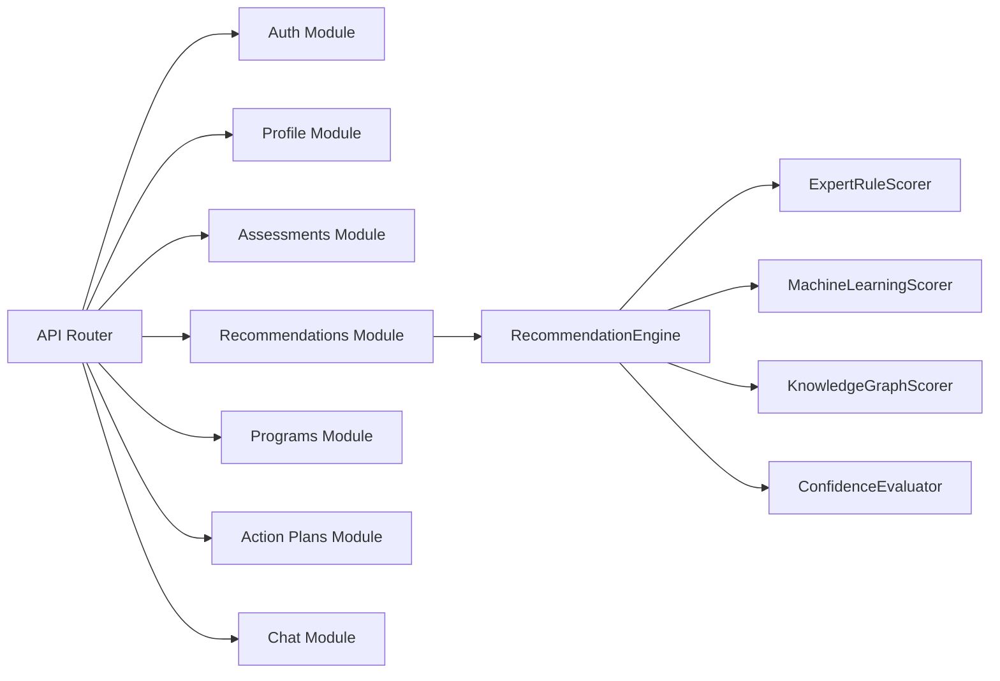

# Component Diagram

```mermaid
flowchart LR
  Router[API Router] --> Auth[Auth Module]
  Router --> Profile[Profile Module]
  Router --> Assessments[Assessments Module]
  Router --> Recommendations[Recommendations Module]
  Router --> Programs[Programs Module]
  Router --> Plans[Action Plans Module]
  Router --> Chat[Chat Module]

  Recommendations --> Engine[RecommendationEngine]
  Engine --> Rules[ExpertRuleScorer]
  Engine --> ML[MachineLearningScorer]
  Engine --> Graph[KnowledgeGraphScorer]
  Engine --> Confidence[ConfidenceEvaluator]
```
