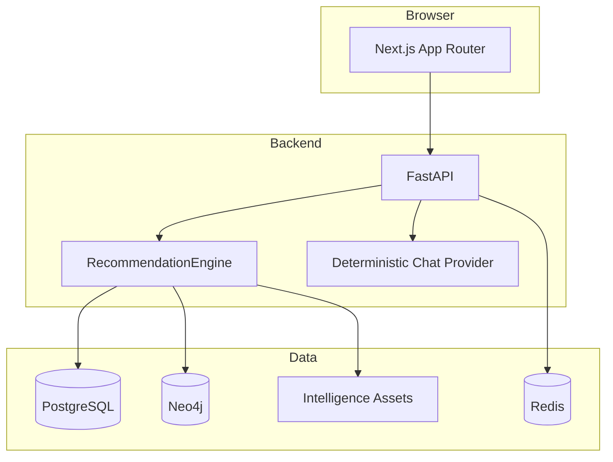

# Container Diagram

```mermaid
flowchart TB
  subgraph Browser
    UI[Next.js App Router]
  end
  subgraph Backend
    API[FastAPI]
    Engine[RecommendationEngine]
    Chat[Deterministic Chat Provider]
  end
  subgraph Data
    PG[(PostgreSQL)]
    R[(Redis)]
    N[(Neo4j)]
    Files[Intelligence Assets]
  end
  UI --> API
  API --> Engine
  API --> Chat
  Engine --> PG
  Engine --> N
  Engine --> Files
  API --> R
```
