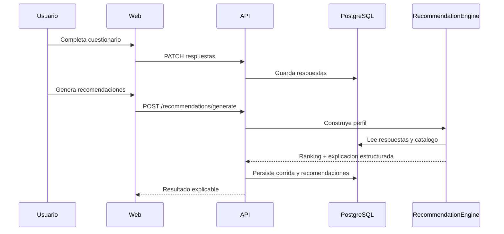

# Data Flow

```mermaid
sequenceDiagram
  participant U as Usuario
  participant W as Web
  participant A as API
  participant DB as PostgreSQL
  participant E as RecommendationEngine
  U->>W: Completa cuestionario
  W->>A: PATCH respuestas
  A->>DB: Guarda respuestas
  U->>W: Genera recomendaciones
  W->>A: POST /recommendations/generate
  A->>E: Construye perfil
  E->>DB: Lee respuestas y catalogo
  E-->>A: Ranking + explicacion estructurada
  A->>DB: Persiste corrida y recomendaciones
  A-->>W: Resultado explicable
```
