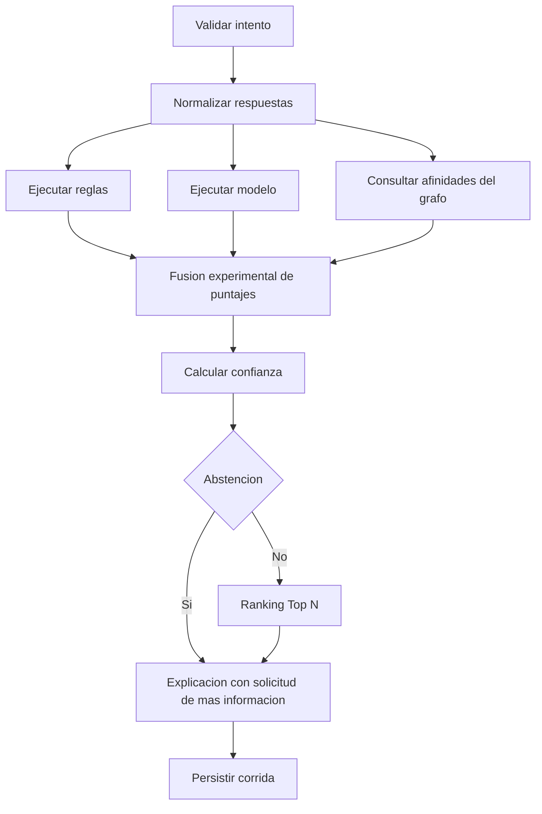

# Recommendation Flow

```mermaid
flowchart TD
  Start[Validar intento] --> Normalize[Normalizar respuestas]
  Normalize --> Rules[Ejecutar reglas]
  Normalize --> ML[Ejecutar modelo]
  Normalize --> Graph[Consultar afinidades del grafo]
  Rules --> Fusion[Fusion experimental de puntajes]
  ML --> Fusion
  Graph --> Fusion
  Fusion --> Confidence[Calcular confianza]
  Confidence --> Abstain{Abstencion}
  Abstain -- Si --> Explain[Explicacion con solicitud de mas informacion]
  Abstain -- No --> Rank[Ranking Top N]
  Rank --> Explain
  Explain --> Persist[Persistir corrida]
```
