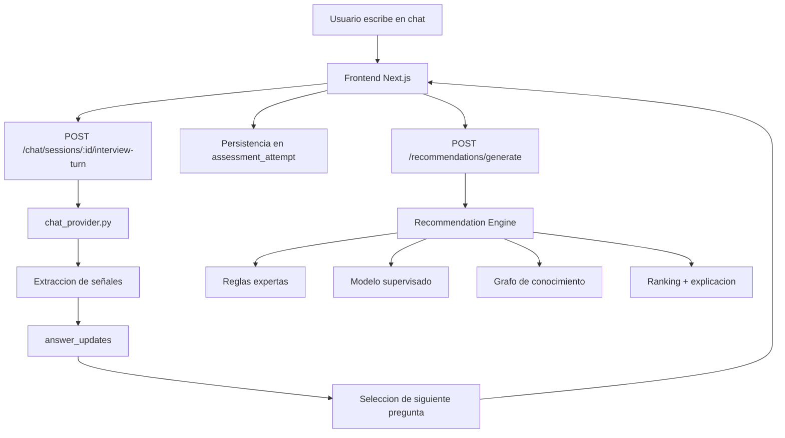

# Motor Conversacional de OrientaIA

## 1. Resumen ejecutivo

OrientaIA no usa un LLM externo como decisor vocacional principal.

La recomendacion final sale del motor hibrido del backend:

- reglas expertas
- modelo supervisado
- grafo de conocimiento

El componente conversacional que el usuario ve en el chat es un motor local y determinista que:

1. interpreta texto libre del estudiante
2. traduce esa conversacion a features estructuradas
3. elige la siguiente pregunta segun la mejor señal disponible
4. persiste las respuestas derivadas
5. dispara el motor de recomendaciones
6. genera un plan asociado al chat

En otras palabras: el chat parece un asistente estilo LLM, pero internamente esta construido con reglas, parsing semantico simple y estrategia de entrevista adaptativa.

## 2. Objetivo del motor conversacional

El motor conversacional se diseno para resolver cuatro problemas:

1. evitar un cuestionario fijo demasiado rigido
2. hacer preguntas dinamicas segun el interes dominante
3. no depender de una API externa
4. mantener trazabilidad de por que se pregunto algo y por que se recomendó una ruta

## 3. Ubicacion del codigo

Los archivos principales son:

- `apps/api/app/services/chat_provider.py`
- `apps/api/app/api/routes/chat.py`
- `apps/api/app/services/recommendation_engine.py`
- `apps/api/app/services/rules.py`
- `apps/api/app/services/ml.py`
- `apps/api/app/services/graph.py`
- `intelligence/rules/rules.yaml`

El frontend del chat consume esta logica desde:

- `apps/web/app/chat/page.tsx`

## 4. Arquitectura funcional

## 5. Modelo mental del sistema

El sistema trabaja con features vocacionales de 1 a 5, por ejemplo:

- `interest_health`
- `interest_social`
- `interest_data`
- `practical_learning`
- `theoretical_learning`
- `teamwork_preference`
- `autonomy_preference`
- `communication`
- `empathy`

Cada mensaje del estudiante puede:

- subir una feature
- bajar una feature
- reforzar una ya existente
- desambiguar un area

## 6. Flujo detallado de una conversacion

### 6.1 Inicio

El chat arranca con una sola pregunta abierta:

> "Cuéntame con libertad qué temas te atraen..."

No se parte de opciones cerradas. El objetivo es capturar texto libre para extraer la primera señal dominante.

### 6.2 Extraccion de señales

La funcion central es:

- `extract_answer_updates(...)`

Esta funcion toma:

- respuestas acumuladas
- mensajes del usuario
- la feature que se estaba evaluando, si existe

Y devuelve:

- `answer_updates`
- `merged_answers`

#### 6.2.1 Dos modos de interpretacion

1. **Modo broad**
   - se usa al inicio
   - intenta detectar areas principales como salud, social, tecnologia o datos

2. **Modo feature**
   - se usa cuando ya se hizo una pregunta concreta
   - interpreta la respuesta respecto a una sola feature

### 6.3 Patrones y keywords

Cada feature tiene:

- `keywords`
- `positive_patterns`
- `negative_patterns`
- `question_seed`
- `hint`

Ejemplo conceptual:

- si aparece `quimica`, `biologia`, `laboratorio`
  - sube `interest_health`
- si aparece `por mi cuenta`
  - sube `autonomy_preference`
  - baja `teamwork_preference`
- si aparece `me gusta ponerlo en practica`
  - sube `practical_learning`

### 6.4 Reglas cruzadas

Ademas del parsing por feature, existe una capa de inferencias cruzadas:

- `_derive_cross_signal_updates(...)`

Esta capa detecta expresiones compuestas que no siempre pertenecen a una sola feature.

Ejemplos:

- `deportes`, `entrenamiento`, `actividad fisica`
  - suben `interest_health`
  - suben `practical_learning`
  - suben `teamwork_preference`

- `lider`, `liderazgo`
  - refuerzan `communication`
  - refuerzan `teamwork_preference`

- `no soy bueno con los numeros`
  - baja `numerical_skill`

## 7. Como decide la siguiente pregunta

La siguiente pregunta no es aleatoria.

Se decide con esta secuencia:

1. detectar el area dominante
2. tomar la lista de follow-ups definida para esa area
3. saltar features ya respondidas
4. preguntar la siguiente feature util
5. cortar la entrevista si ya hay suficiente evidencia

Funciones clave:

- `_area_signal_from_messages(...)`
- `_choose_seed_area(...)`
- `_follow_ups_for_area(...)`
- `_pick_next_feature(...)`
- `generate_interview_turn(...)`

## 8. Ejemplo real: caso "quimica"

### Entrada inicial

`"me gusta la quimica"`

### Señal extraida

- `interest_health = 5`

### Siguiente paso

En versiones anteriores el sistema podia saltar demasiado rapido a numerico o social.

Ahora la logica prioriza preguntas mas coherentes con ciencias naturales, por ejemplo:

- `theoretical_learning`
- `practical_learning`
- `autonomy_preference`

Solo despues, si hace falta:

- `numerical_skill`

## 9. Ejemplo real: caso "deportes"

### Entrada inicial

`"me gusta todo lo que tenga que ver con los deportes"`

### Problema anterior

El sistema no tenia una señal explicita para deporte y acababa cayendo en social por descarte.

### Correccion aplicada

Ahora `deportes` genera estas señales iniciales:

- `interest_health`
- `practical_learning`
- `teamwork_preference`

Y las preguntas siguientes se orientan a:

- aprendizaje practico
- trabajo en equipo
- autonomia
- empatia

Eso hace mucho mas probable que suban opciones como:

- `fisioterapia`
- `educacion`
- `enfermeria`

y reduce casos absurdos como terminar en `trabajo-social` sin evidencia suficiente.

## 10. Reflexion conversacional

El usuario no ve solo la siguiente pregunta. Antes se construye una reflexion intermedia:

- `build_interview_reflection(...)`

Esa reflexion resume:

- que señal se detectó
- con qué intensidad
- hacia qué area se está inclinando el perfil

Esto da sensacion de asistente conversacional, aunque el sistema sea completamente trazable.

## 11. Integracion con el motor hibrido

Cuando el usuario procesa el analisis, el frontend completa el intento y llama:

- `POST /recommendations/generate`

El backend ejecuta:

1. `score_rules(features)`
2. `score_ml(features)`
3. `score_graph(features)`
4. fusion ponderada
5. calculo de confianza
6. construccion de explicacion

La formula actual usa pesos configurables en `config.py`.

## 12. Fusion de puntajes

La recomendacion final usa tres fuentes:

### 12.1 Reglas expertas

Definidas en:

- `intelligence/rules/rules.yaml`

Ventaja:

- alta interpretabilidad

Ejemplo:

- si salud + practica + equipo
  - subir `fisioterapia`

### 12.2 Modelo supervisado

Se carga desde:

- `intelligence/models/artifacts/approved_model.joblib`

El sistema entrena varios candidatos y selecciona el mejor por metricas.

Actualmente la red neuronal existe como candidato academico, pero el modelo activo puede seguir siendo otro si rinde mejor.

### 12.3 Grafo de conocimiento

Modela relaciones entre:

- intereses
- skills
- programas

Sirve como refuerzo explicativo y estructural.

## 13. Por que no se usa un LLM externo como decisor

Se decidió no delegar la recomendacion principal a un LLM por tres razones:

1. trazabilidad
2. consistencia
3. control de sesgos y alucinaciones

El sistema debe poder justificar:

- por qué preguntó algo
- qué señal extrajo
- por qué recomendó una carrera

Eso es mucho mas facil con reglas, features y modelos tabulares.

## 14. Estado visual de "pensando"

En el frontend se agrego un estado intermedio:

- `isThinking`

Cuando el backend tarda un poco en responder:

- se desactiva el input
- el boton cambia a `Pensando...`
- aparece una burbuja con `Analizando tu respuesta...`

Esto hace visible que el motor esta trabajando aunque no exista streaming real de tokens.

## 15. Limitaciones actuales

1. sigue siendo un motor local y acotado
2. no entiende ironia o lenguaje muy ambiguo
3. si el catalogo no contiene una carrera deportiva especifica, aproxima a la mas cercana
4. el modelo supervisado depende de datos sinteticos
5. el plan de accion todavia puede sonar mas mecanico de lo ideal

## 16. Extensiones futuras

Las siguientes mejoras ya tienen un camino claro:

1. agregar una categoria o programa tipo `ciencias del deporte`
2. introducir memoria de conversacion por tema
3. usar un LLM opcional solo para reescritura natural
4. mantener la explicacion factual separada del texto final
5. agregar mas señales de contexto como liderazgo, competencia, disciplina o rehabilitacion

## 17. Conclusion

El "LLM" actual de OrientaIA en realidad es un motor conversacional local, explicable y controlado.

Se comporta como un asistente porque:

- hace preguntas dinamicas
- adapta el flujo a lo ya dicho
- resume señales
- genera un plan por chat

Pero la base tecnica real es:

- parsing semantico local
- reglas
- features numéricas
- recomendacion hibrida
- persistencia por sesion

Ese diseño permite que la experiencia sea flexible sin perder control ni trazabilidad.
